# Making a game under 72 hours

## Building the visual identity of Almost immortal

### Concept • Model • Texture

Almost immortal is a browser game made under 72 hours

<picture class="my-7">
  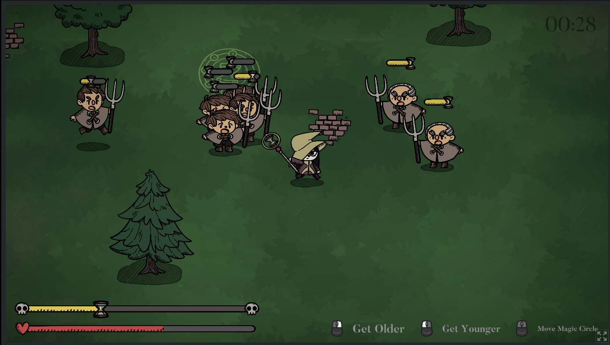
</picture>

Once we had an idea of the design for the game, I made a mockup to get and communicate a general idea of the direction and to be able to make quick iterations.
We are missing a bit here and there in the final version because we were short on time, but I think it's pretty close! The Idea wasn't too unreasonable.

<picture class="my-7">
  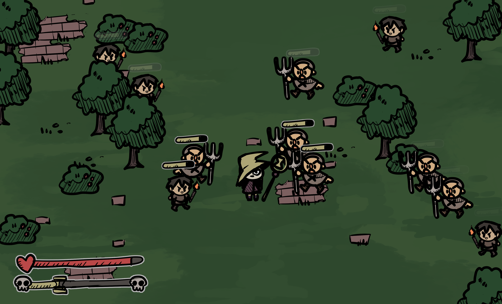
</picture>

Almost every asset in this game has 3 life-stage versions.

  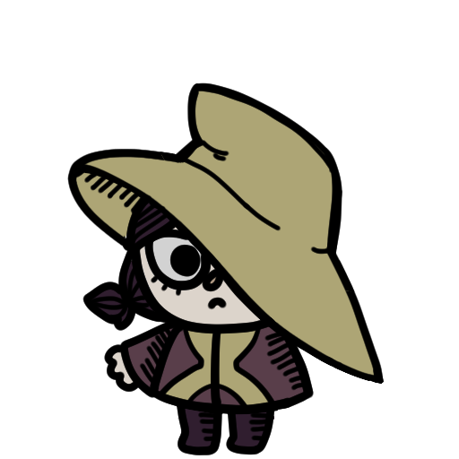
  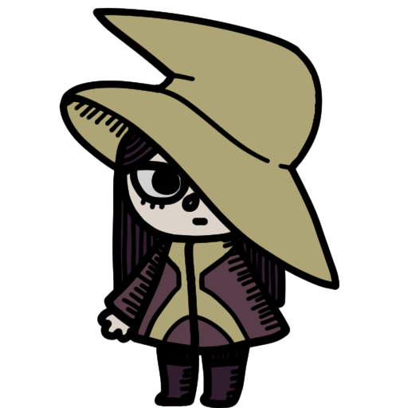
  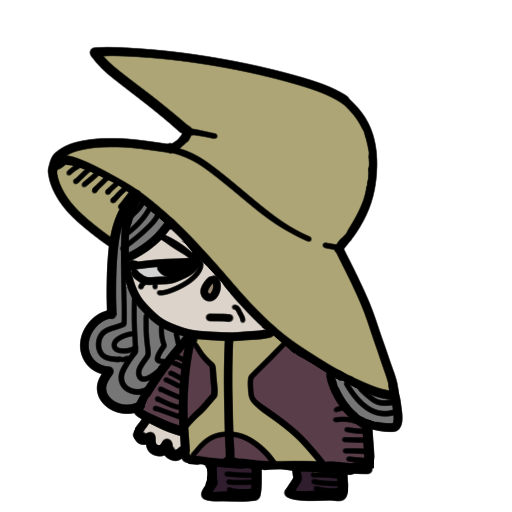

Our main character without the arm that grabs the wand (so we can rotate it using the player's cursor!)

  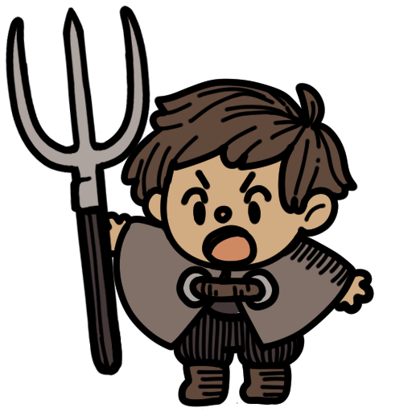
  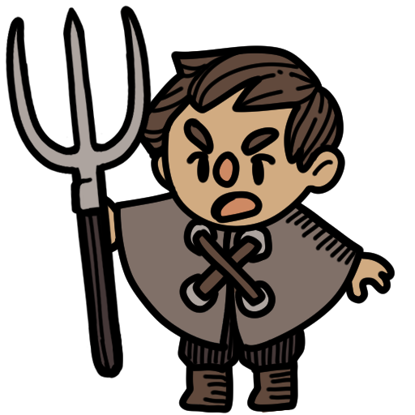
  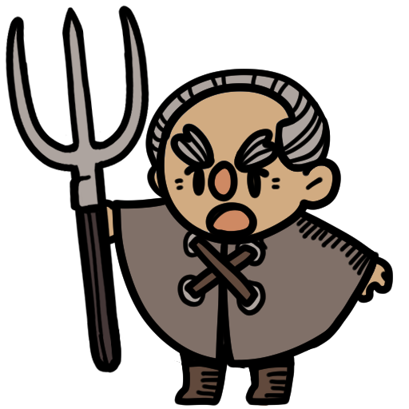
  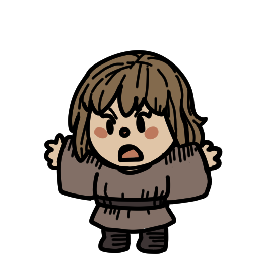
  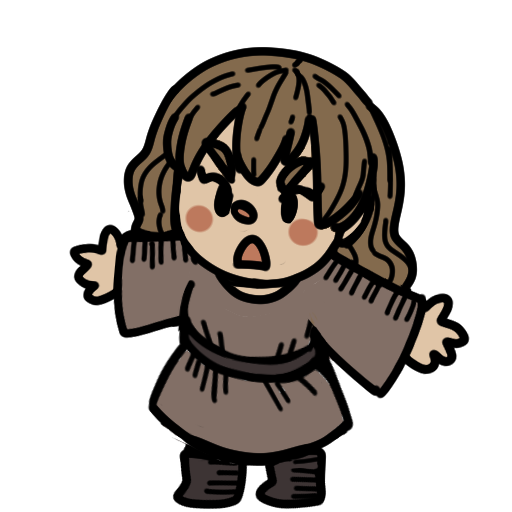
  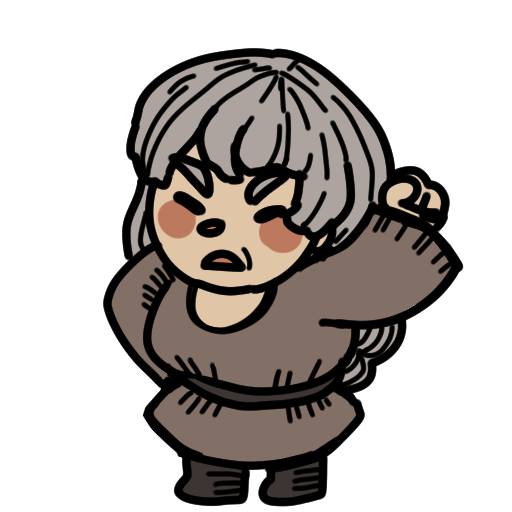
  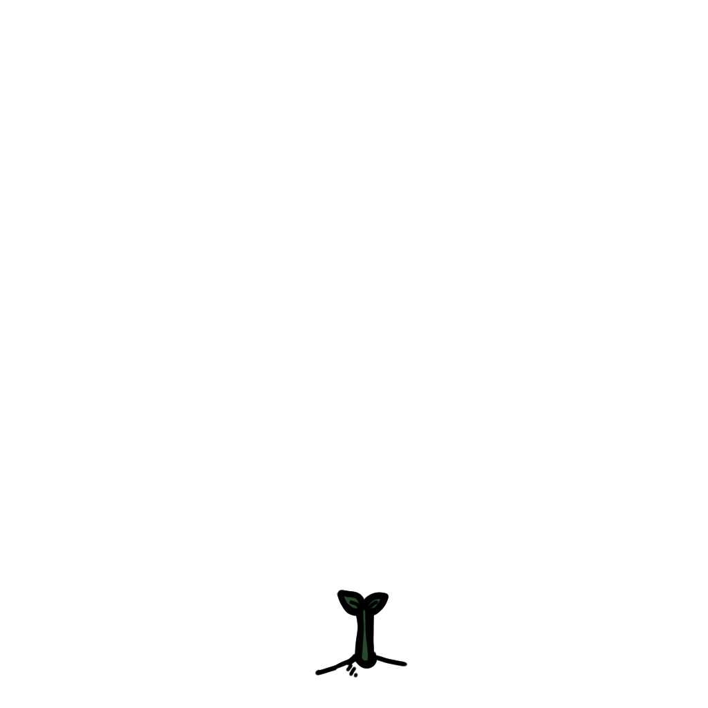
  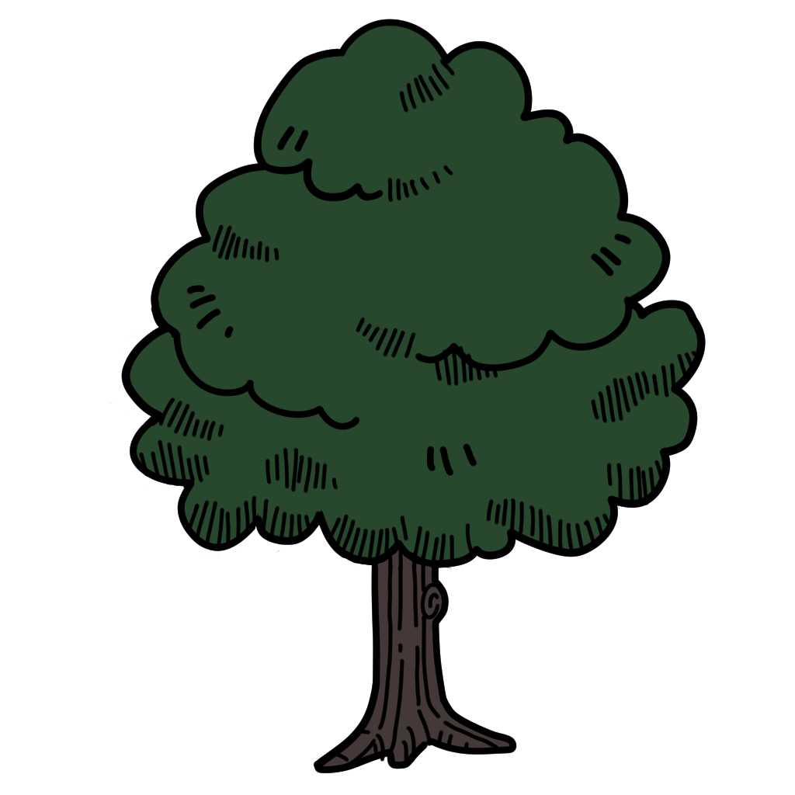
  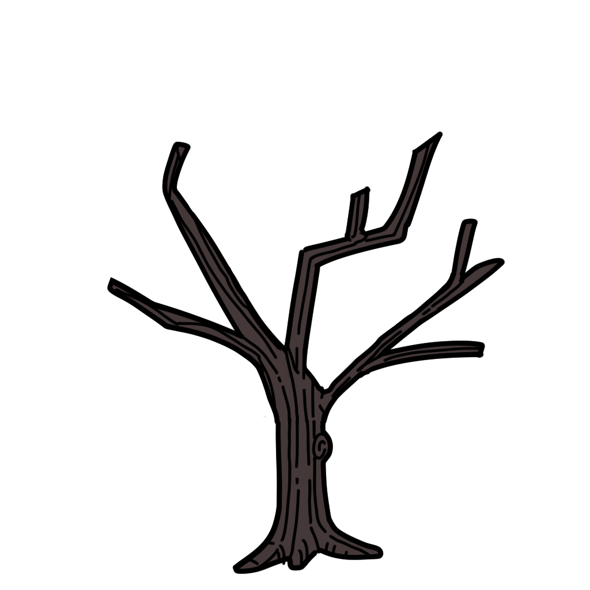
  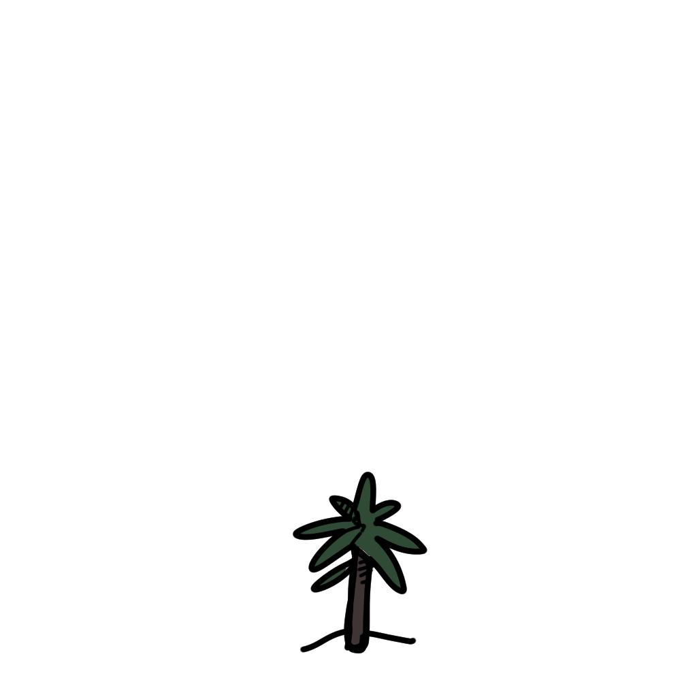
  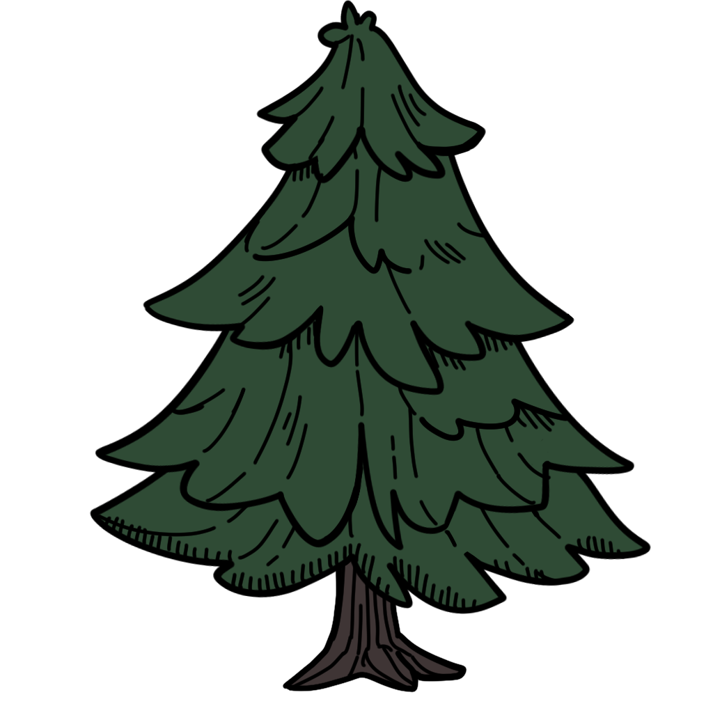
  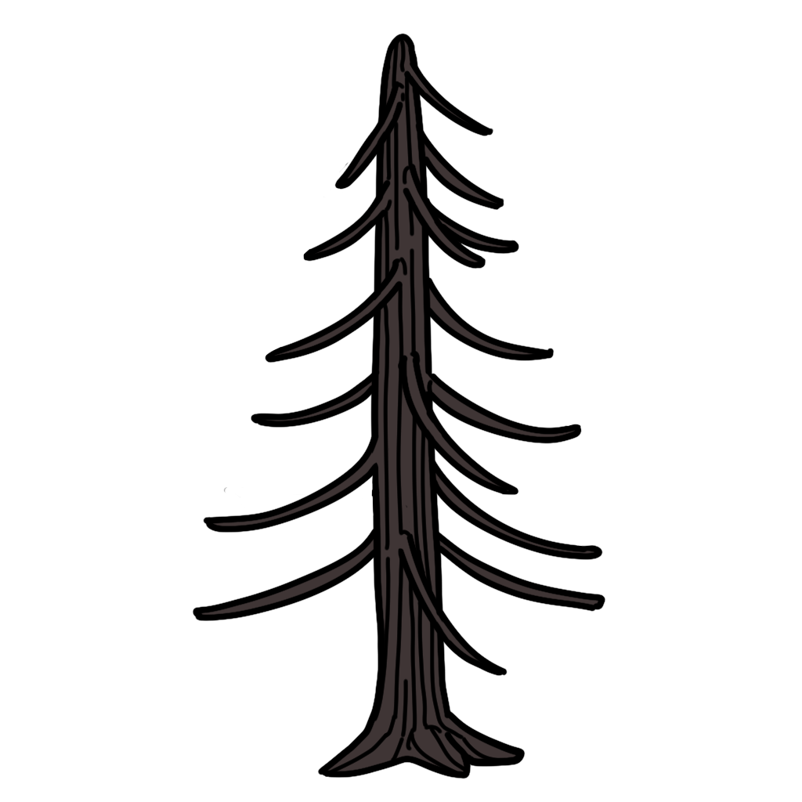
  

  
  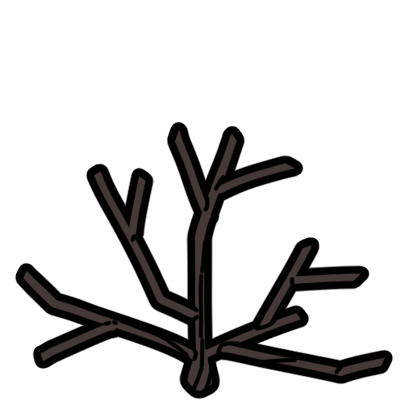

  I had fun making hand drawn vfx on this one.

  

    
    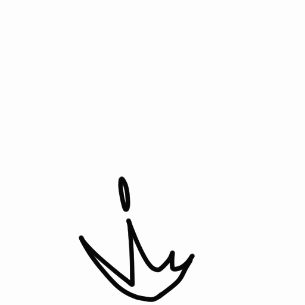
  
