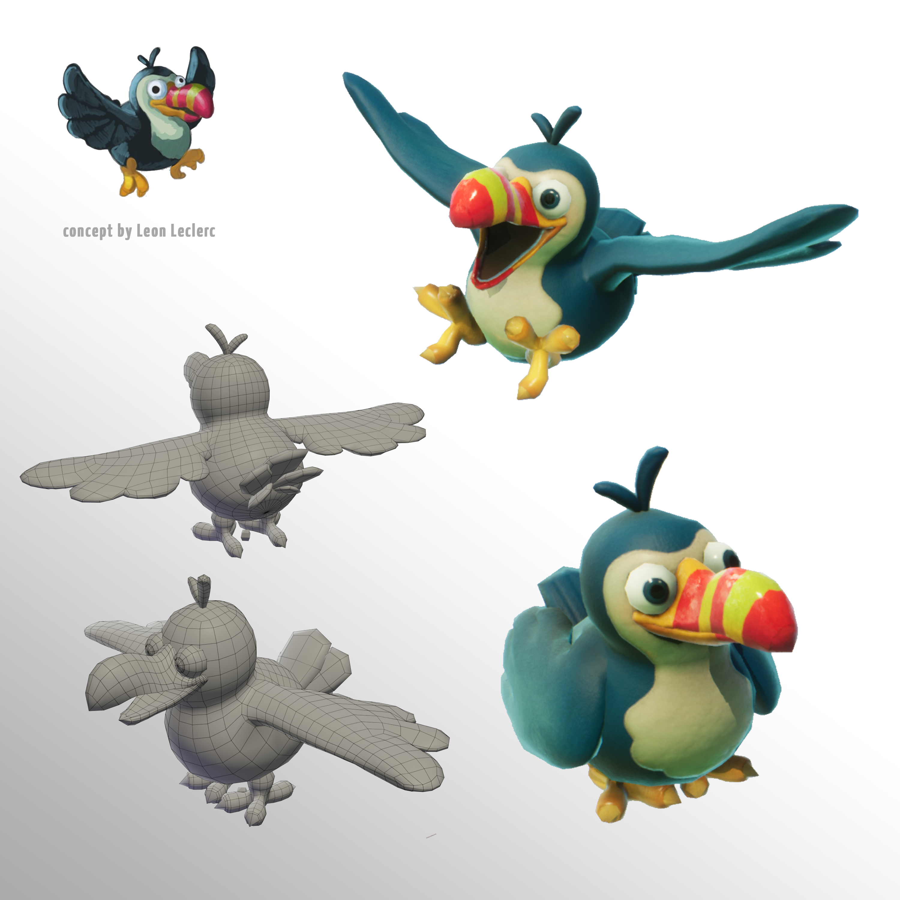
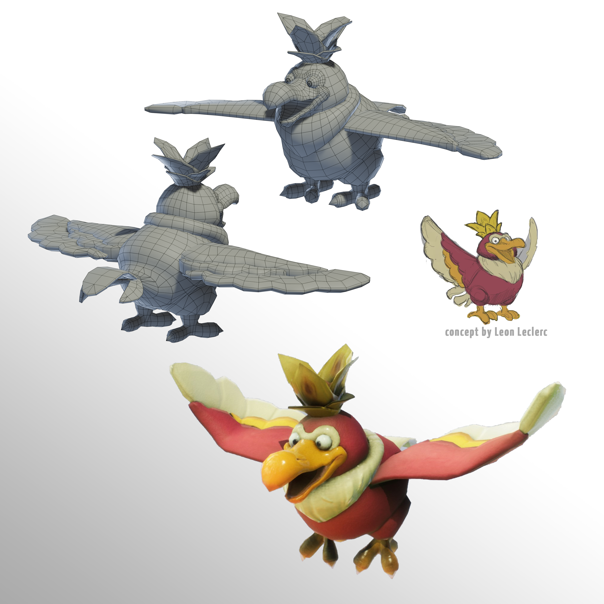

# The character art of Jungle Dunk

## Making stylized characters for a fast-paced game

### Concept • Model • Texture

*Jungle Dunk* is a 4vs4 platformer game in which teamplay is key to score the most fruits in the volcano.   
This was my and my team's graduation project. It has been made in *Unreal Engine 4*.

I was also the animator for this project! You can learn more about it <a href="../../../animations/anim-jdb">here</a>.

For all these characters, I did my best to stay as close to as possible to the 2D concept as to keep their original appeal.

The design of these monkey characters had a lot of iterations and were a team effort. I refined the final design shown here. To give the most personnality to the characters without putting in too much complexity, I designed them with *interchangeable face parts* in mind. It was the most suitable solution for the project as the character move a lot and I was the only animator and character artist on the project. For these reasons full facial rig would have been overkill and possibly more limited for how far I could push the expressions and visual simplifications. 

<picture>
  
</picture>

<picture class="my-7">
  
</picture>

Since the bird king was to be seen from further away, I gave it a pretty low poly count considering its size.
<picture>
  
</picture>