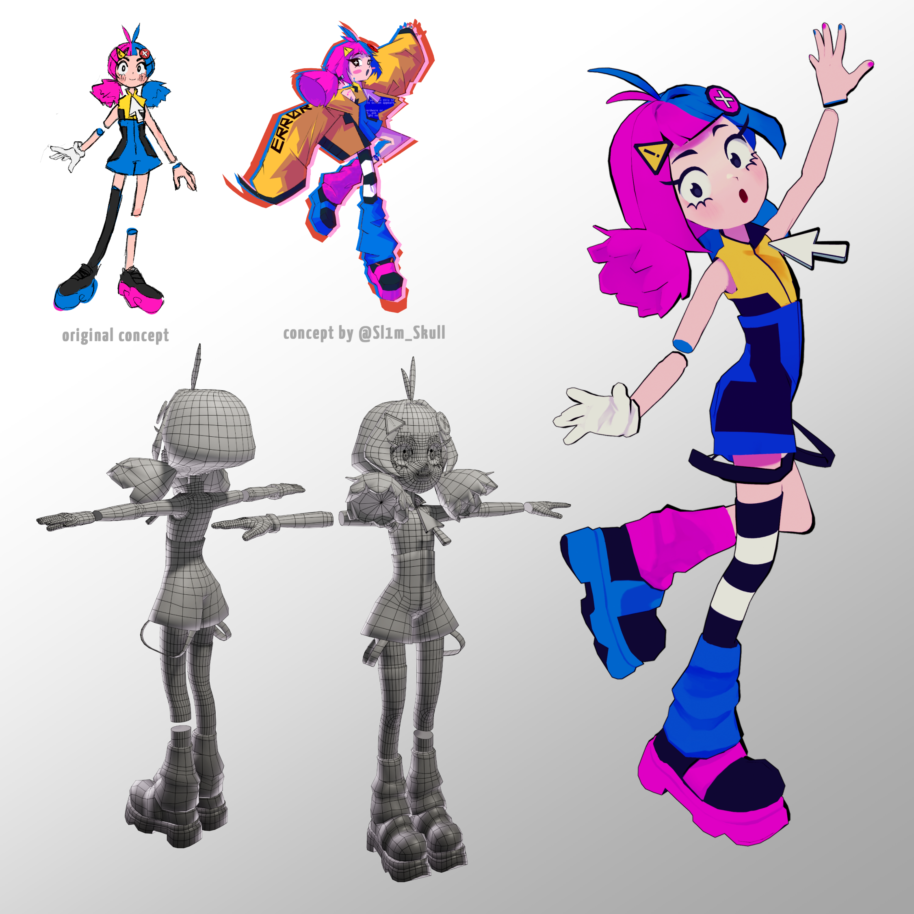

# Personnal project

## Making a stylized character for facial mocap

### Concept • Model • Texture • Rig

This model is a personnal project of mine made with the idea of crontrolling it via facial motion capture datas.
What if a computer bug gave birth to a friendly character? The main attributes of the character are based on computer iconography, blue screen error and missing texture color. I also made her a little bug side-kick with its own 3D model to come.

I made the first draft and <a href=https://linktr.ee/slimskull>@Slim_Skull</a>, a friend of mine, made his own version that contributed to the final model of the character.

<picture class="my-7">
  
</picture>

Video showcasing tests of the character moving with live facial motion capture

<video style="max-width: 90%" controls>
<source src="../../assets/Vmodel_test.mp4" /> 

