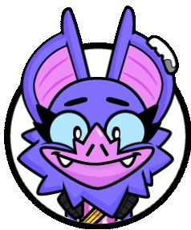
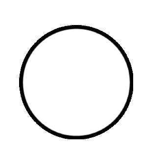
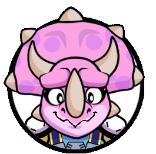
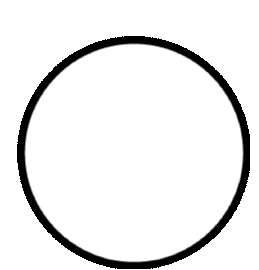
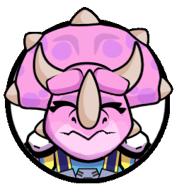
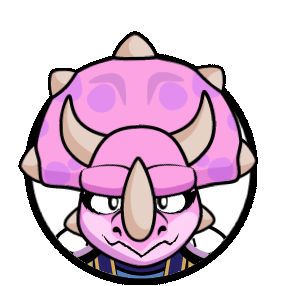

# Animating for BEAST

## Making 3D animations for playable characters

### Rigging • Skinning • Animation

*BEAST* is a third person shooter made by game studio *OhBibi!*, it is available to download from the *Apple Arcade*.

I was responsible for the entire character of Kaplan the koala with his robot, which I both rigged using partially auto rig _Rigify_, skinned and animated for menus and gameplay.
I was in charge of the robot of Eugene the Ourangoutan as well, for which I made the rig from scratch (as it is pretty far from humanoid), skin and gameplay animations. I chose to stray away from completely mechanicals movements on purpose for Eugene's robot, as it is contamined by plants that bring it to life rather than being powered by usual means.

<video controls>
  <source src="../../assets/reel_beast.mp4" />
</video>
You can tap on the character in the menu to see them react!

## Making emotes using Spine2D

### Rigging • Skinning • Animation

All the characters in the game have their own animated emotes made with *Spine2D*... and I had the opportunity to make some of them!     

  

  
  
  

  

  
  
  

  

  
  
  

       

here they are!
   
<a href="../anim-ggm2D">More of my Spine2D work can be seen in my post about the 2D animation of <i>Go Go magnet!</i> . </a>

